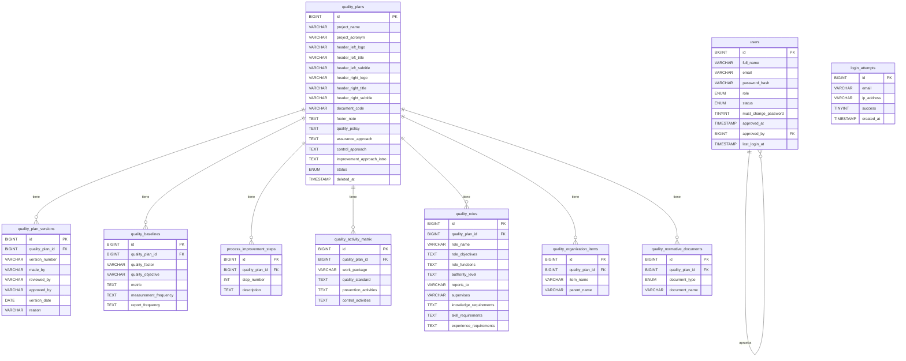

# Diagrama de base de datos - MVP Plan de Gestion de Calidad

```mermaid
erDiagram
    users ||--o{ users : aprueba
    quality_plans ||--o{ quality_plan_versions : tiene
    quality_plans ||--o{ quality_baselines : tiene
    quality_plans ||--o{ process_improvement_steps : tiene
    quality_plans ||--o{ quality_activity_matrix : tiene
    quality_plans ||--o{ quality_roles : tiene
    quality_plans ||--o{ quality_organization_items : tiene
    quality_plans ||--o{ quality_normative_documents : tiene

    users {
        BIGINT id PK
        VARCHAR full_name
        VARCHAR email
        VARCHAR password_hash
        ENUM role
        ENUM status
        TINYINT must_change_password
        TIMESTAMP approved_at
        BIGINT approved_by FK
        TIMESTAMP last_login_at
    }

    login_attempts {
        BIGINT id PK
        VARCHAR email
        VARCHAR ip_address
        TINYINT success
        TIMESTAMP created_at
    }

    quality_plans {
        BIGINT id PK
        VARCHAR project_name
        VARCHAR project_acronym
        VARCHAR header_left_logo
        VARCHAR header_left_title
        VARCHAR header_left_subtitle
        VARCHAR header_right_logo
        VARCHAR header_right_title
        VARCHAR header_right_subtitle
        VARCHAR document_code
        TEXT footer_note
        TEXT quality_policy
        TEXT assurance_approach
        TEXT control_approach
        TEXT improvement_approach_intro
        ENUM status
        TIMESTAMP deleted_at
    }

    quality_plan_versions {
        BIGINT id PK
        BIGINT quality_plan_id FK
        VARCHAR version_number
        VARCHAR made_by
        VARCHAR reviewed_by
        VARCHAR approved_by
        DATE version_date
        VARCHAR reason
    }

    quality_baselines {
        BIGINT id PK
        BIGINT quality_plan_id FK
        VARCHAR quality_factor
        VARCHAR quality_objective
        TEXT metric
        TEXT measurement_frequency
        TEXT report_frequency
    }

    process_improvement_steps {
        BIGINT id PK
        BIGINT quality_plan_id FK
        INT step_number
        TEXT description
    }

    quality_activity_matrix {
        BIGINT id PK
        BIGINT quality_plan_id FK
        VARCHAR work_package
        TEXT quality_standard
        TEXT prevention_activities
        TEXT control_activities
    }

    quality_roles {
        BIGINT id PK
        BIGINT quality_plan_id FK
        VARCHAR role_name
        TEXT role_objectives
        TEXT role_functions
        TEXT authority_level
        VARCHAR reports_to
        VARCHAR supervises
        TEXT knowledge_requirements
        TEXT skill_requirements
        TEXT experience_requirements
    }

    quality_organization_items {
        BIGINT id PK
        BIGINT quality_plan_id FK
        VARCHAR item_name
        VARCHAR parent_name
    }

    quality_normative_documents {
        BIGINT id PK
        BIGINT quality_plan_id FK
        ENUM document_type
        VARCHAR document_name
    }
```
